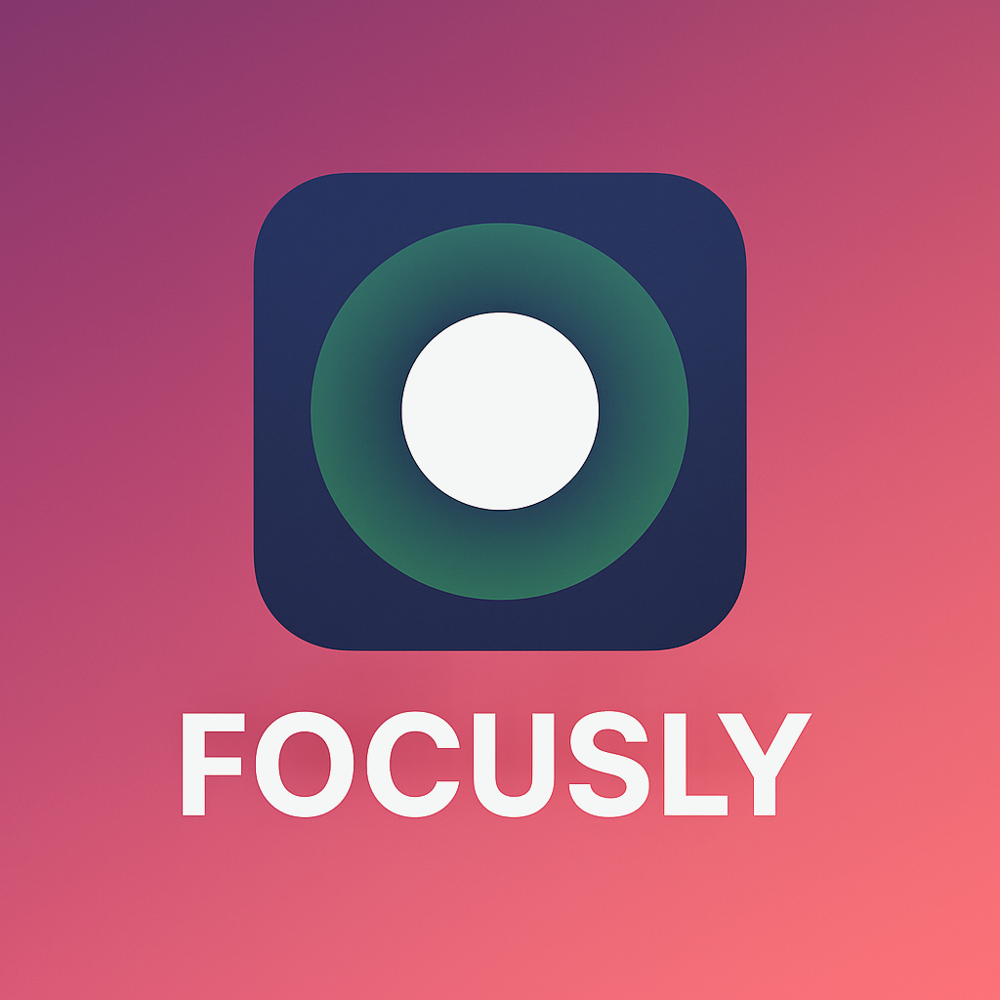

# 🌙 Focusly — macOS Ambience & Focus Companion

> 🧪 **Alpha 0.3** - building toward a refined and stable focus experience.


<p align="center">
  
</p>

---

## ✨ Overview

**Focusly** is a lightweight menu bar companion for macOS. It softens each display with a glassy overlay, keeps distractions under control, and gives you per-monitor ambience controls without getting in the way.

Focusly tracks the active window (with your permission) so the foreground content stays sharp while the rest of the desktop calmly fades back. Presets, per-display overrides, and localizations live directly inside the Swift Package so contributors can tweak everything with familiar tooling.

---

## ⚡️ Feature Highlights

- 🎛️ **Instant Menu Bar Control** - toggle overlays, switch presets, and update preferences in a click.  
- 🪟 **Context-Aware Focus Masking** - keeps the active window clear while softening the background.  
- 🎨 **Preset Library** - Focus, Warm, Colorful, and Monochrome looks 
- 🖥️ **Per-Display Ambience** - individual tint, opacity, and color for every monitor.  
- ⌨️ **Global Shortcut** - customizable Carbon-backed hotkey for instant control.  
- 🚀 **Launch at Login** - integrates with `SMAppService` when running as a bundled `.app`.  
- 🧭 **Guided Onboarding** - assists with setup, permissions, and language selection.  
- 🌐 **Localization Ready** - runtime language switching with support for English, Spanish, Spanish (Mexico), French, Italian, Arabic (Modern Standard), Swahili (Kiswahili), Hausa, Simplified Chinese, Ukrainian, Russian, Japanese, Korean, and Thai.

---

## upcoming features

- **Overlay Performance** - higher refresh rates through gpu acceleration
- **Settings Menu** - rework of the settings window

---

## 💻 Requirements

- macOS **13 Ventura** or newer  
- **Accessibility permission** (recommended) for accurate window tracking  
- **Xcode 15 / Swift 6.2.1** or later for source builds  

---

## 🚀 Run the Alpha 0.2 Build

Precompiled alpha binaries are included for quick testing:

1. Mount `Focusly.dmg` and drag `Focusly.app` to `/Applications`.  
2. Control-click the app → **Open**, confirm under **System Settings › Privacy & Security**.  
3. Grant Accessibility permission: **System Settings › Privacy & Security › Accessibility** → enable **Focusly**.  
4. The menu bar icon appears — toggle **Enable Overlays** to begin.

> _If your workspace suddenly feels too cozy, that’s Focusly doing its job — or maybe you just need another café solo._

You can always grab the latest `.dmg` for **Alpha 0.2** from [GitHub Releases](https://github.com/your-user/macos-focusly/releases).

---

## 🧠 Build from Source (Alpha 0.3)

To build the latest alpha version directly from source using Xcode:

```bash
git clone https://github.com/your-user/macos-focusly.git
cd macos-focusly
xcodebuild -scheme Focusly -configuration Release
```

Or open the project manually:

1. Launch **Xcode 15+**  
2. Open `Package.swift`  
3. Select the **Focusly** scheme  
4. Hit **⌘R** to build and run  

The built `.app` will appear under:  
```
.build/release/Focusly.app
```

---

## 📦 Bundle & Distribution

- `./build_app.sh` → Builds an unsigned `Focusly.app` from the latest Swift build.  
- `./build_dmg.sh` → Packages `Focusly.app` and documentation into a shareable `.dmg`.  
- Prefer `swift build -c release` before packaging for optimized binaries.

---

## 🔐 Signing the App Bundle

The generated `Focusly.app` ships unsigned, so macOS Gatekeeper will flag it until you apply a signature.

**Quick option via Homebrew cask**

```bash
brew install --cask alienator88-sentinel
```
drop .app in Sentinel Window or

```bash
alienator88-sentinel sign Focusly.app \
  --identity "Developer ID Application: Your Name (TEAMID)"
```

- Replace the identity with your Developer ID certificate name (or use `--identity "-"` for ad-hoc signing while testing).  
- Run `spctl --assess --type exec Focusly.app` to confirm Gatekeeper now trusts the bundle.

Public releases posted to GitHub will ship pre-signed and notarized so Gatekeeper opens them without extra prompts.

---

## 🛠️ Development Notes

- **Window Tracking:** `WindowTracker` polls the Accessibility API; it automatically downgrades to CoreGraphics if permission is missing but overlays lose precision.  
- **Debug Overlay:** Launch with `FOCUSLY_DEBUG_WINDOW=1` or toggle the hidden preference key `FocuslyDebugWindow` to monitor tracked frames.  
- **Tracking Profiles:** Preferences expose `WindowTrackingProfile` presets (standard, responsive, etc.); polling cadence lives in `OverlayController`.  
- **Launch at Login:** `LaunchAtLoginManager` requires Focusly to run from a bundled, signed `.app`; CLI targets expose the control but surface a localized warning.  
- **Localization & Presets:** Translations live under `Sources/Resources/*.lproj`; overlay looks are defined in `PresetLibrary` so new presets can be added alongside localized names.

---

## 🧪 Tests

```bash
swift test
```

The suite currently covers:
- `ProfileStore` persistence  
- Preset override behavior  

Further tests will be added as more logic moves outside the UI layer.

---

## 🧱 Architecture Overview

- **Entry Point & Coordination**  
  `AppDelegate` (`Sources/main.swift`) bootstraps the app, requests Accessibility permission, and wires up `FocuslyAppCoordinator`. The coordinator receives a `FocuslyEnvironment` that injects `UserDefaults`, notification centers, `NSWorkspace`, and the launch-at-login bridge so services can be swapped for testing.
- **Overlay Pipeline**  
  `OverlayService` creates and owns an `OverlayWindow` per connected `NSScreen`, applying styles from `ProfileStore` and `PresetLibrary`. `OverlayController` listens to `WindowTracker` snapshots, calculates carve-out masks, and forwards them to overlay windows while `PointerInteractionMonitor` and `DisplayLinkDriver` smooth cursor interactions and animations.
- **State & Persistence**  
  `ProfileStore` serializes the active preset, per-display overrides, and excluded monitors, while `AppSettings` exposes observable flags such as `overlayFiltersActive` and the selected `WindowTrackingProfile`. `FocusProfileModels` defines the Codable overlay style, and `FocuslyBuildInfo` surfaces bundle metadata for UI.
- **User Interface Surfaces**  
  `StatusBarController` renders the menu bar item, uses `StatusBarState` to build menus, and delegates actions back to the coordinator. Preferences and onboarding flows are SwiftUI views (`PreferencesView`, `OnboardingView`) hosted inside AppKit window controllers (`PreferencesWindowController`, `OnboardingWindowController`) so the menu bar app can present them on demand.
- **System Integrations**  
  `HotkeyCenter` registers global shortcuts via Carbon, `LaunchAtLoginManager` wraps `SMAppService`, `LocalizationService` manages runtime language overrides, and `WindowResolver` plus `DisplayID` utilities bridge the Accessibility API and CoreGraphics display identifiers.

---

## 🌐 Localization

Available in:

- 🇬🇧 English  
- 🇪🇸 Español  
- 🇲🇽 Español (México)  
- 🇫🇷 Français  
- 🇮🇹 Italiano  
- 🇦🇪 العربية (الفصحى الحديثة)  
- 🇹🇿 Kiswahili  
- 🇳🇬 Hausa  
- 🇨🇳 中文（简体）  
- 🇺🇦 Українська  
- 🇷🇺 Русский  
- 🇯🇵 日本語  
- 🇰🇷 한국어 (대한민국)  
- 🇹🇭 ภาษาไทย  

Additional community docs live under [`Documentation/`](Documentation/), including localized guides in Arabic, Kiswahili, and Hausa.

> _In Spanish, “enfocar” means “to focus” — and yes, Focusly is quite the “enfocador”._

---

## 📜 License

Released under the **MIT License**. See [LICENSE](./LICENSE) for full details.  

> ⚠️ Focusly is free to use during the alpha phase. Optional paid upgrades may come once stability is reached.

---

**Made with ❤️**
